# ☕ Mini Shop

A modern coffee shopping mobile application built with **Flutter** and **Firebase**, with a clean feature-based architecture, state management using **Bloc/Cubit**, automated testing, and a **CI/CD pipeline**.

> A portfolio project focused on building a complete shopping experience from authentication and product browsing to cart management, checkout, location selection, and order tracking.

---

## ✨ Features

### 🔐 Authentication

* Email & Password authentication
* Phone number authentication
* User registration
* Change password
* Reset password

### ☕ Products

* Browse coffee products
* Product details
* Category filtering
* Product search
* Product quantity management

### ❤️ Favorites

* Add and remove products from favorites
* Persistent favorites using Firebase

### 🛒 Cart

* Add products to cart
* Increase and decrease product quantity
* Remove products from cart
* Calculate total price
* Clear cart

### 🧾 Checkout

* Review cart items
* Select delivery address
* Select payment method
* Complete the checkout flow

### 📍 Location

* Select delivery location using an interactive map
* Geolocation and address handling

### 📦 Orders

* Create orders
* View order history
* View order details

### ⚙️ Settings

* Sign Out
* Change password
* About Us
* Light and Dark theme support

---

## 📸 Screenshots

### 🔐 Authentication


| Email Login | Phone Login | Register   |
| ----------- | ----------- | ---------- |
| 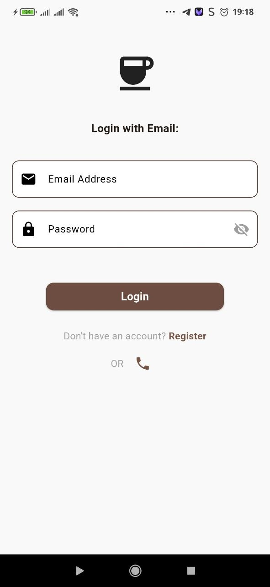 | 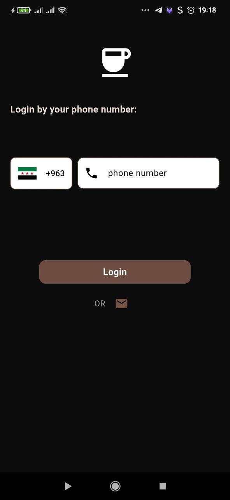  | 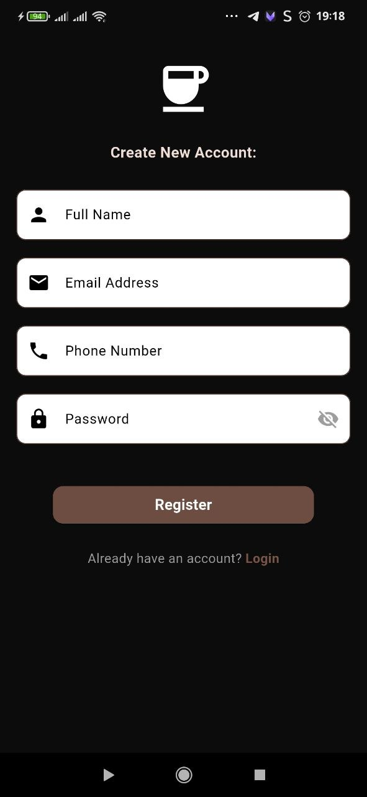 |

### 🏠 Home & Products

| Home  - dark     |  Home - light      | 
| ---------- |  ---------- | 
| 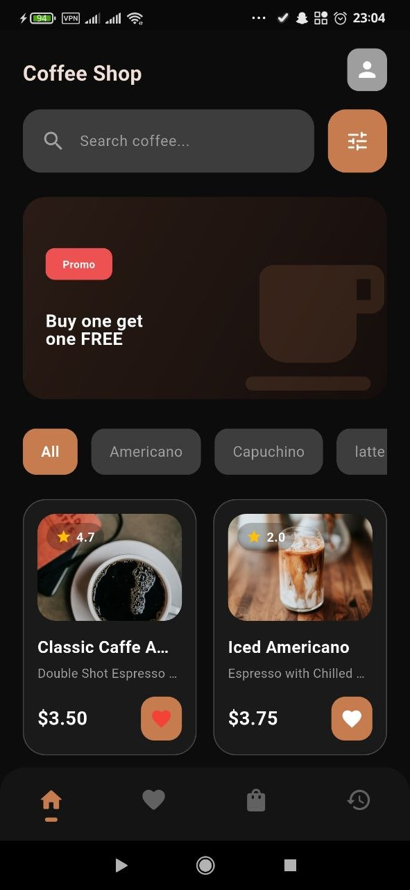 |  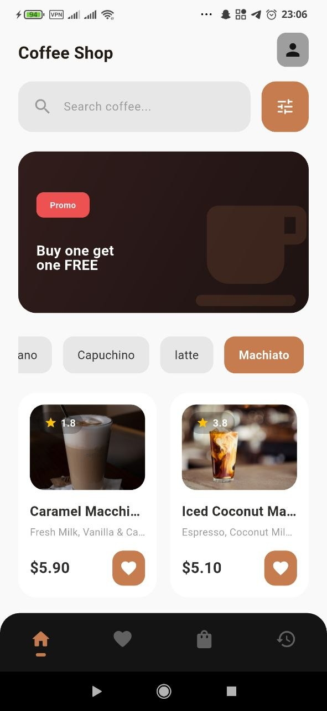 |

| Coffee Details | Search     |
| -------------  | ---------- |
|  |  |

### ❤️ Favorites

| Favorites - Dark | Favorites - Light |
| ---------------- | ----------------- |
| 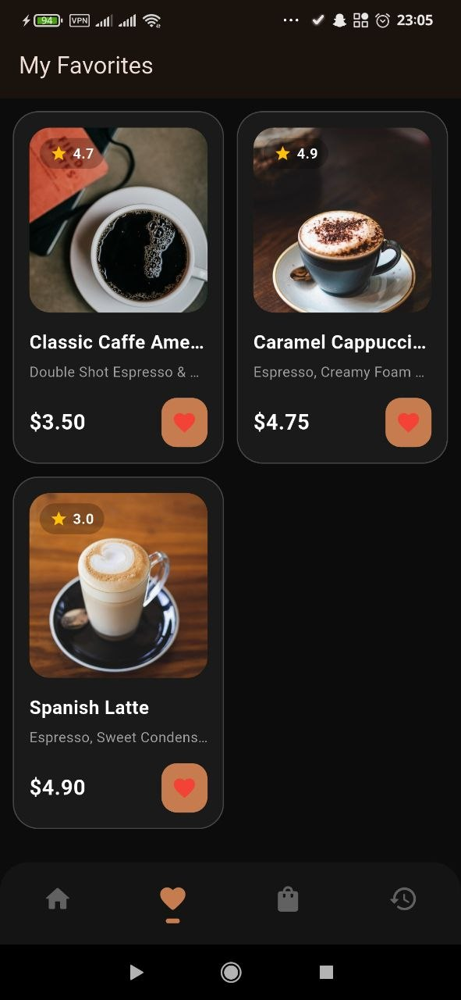  | 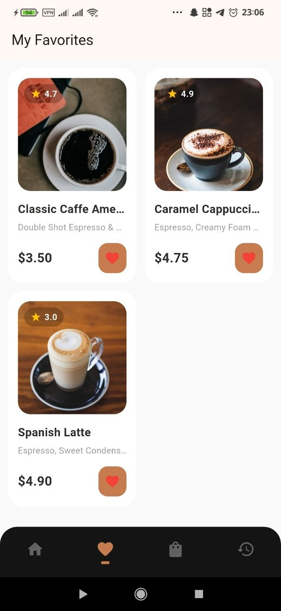  |

### 🛒 Cart & Checkout

| Cart - Dark | Cart - Light | Empty Cart |
| ---------- |  ---------- | ---------- |
| 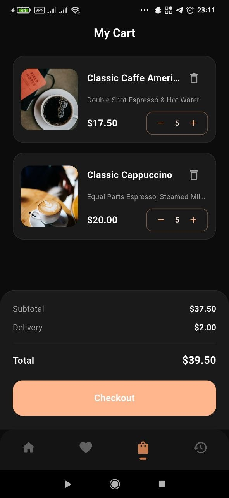  | 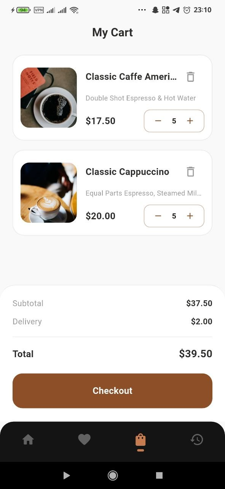  | 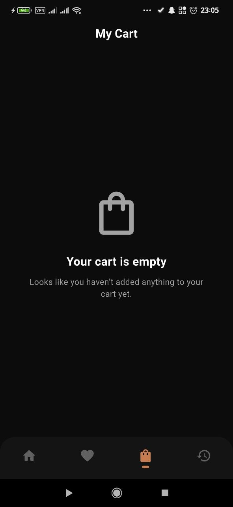  |

| Checkout - Dark | Checkout - Step 2 | Checkout - Light |
| --------------- | ----------------- | ---------------- |
|   |  |  |

### 💳 Payment

| Payment - Dark | Payment - Light |
| -------------- | --------------- |
| 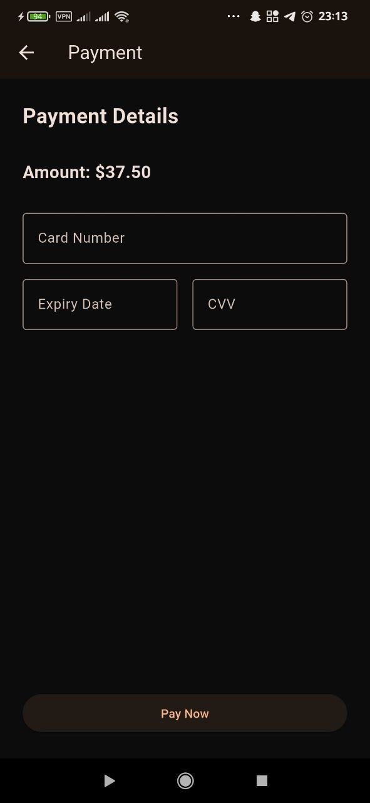  |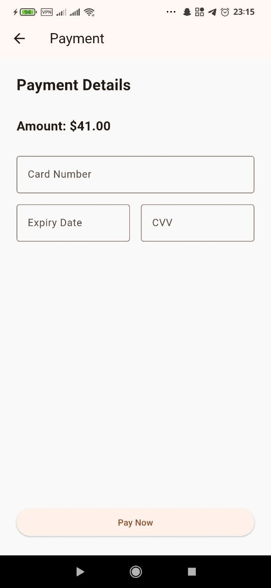  | 

### 📍 Location

| Location |
| -------- |
|   | 

### 📦 Orders

| Orders     | Order Details |
| ---------- | ------------- |
| 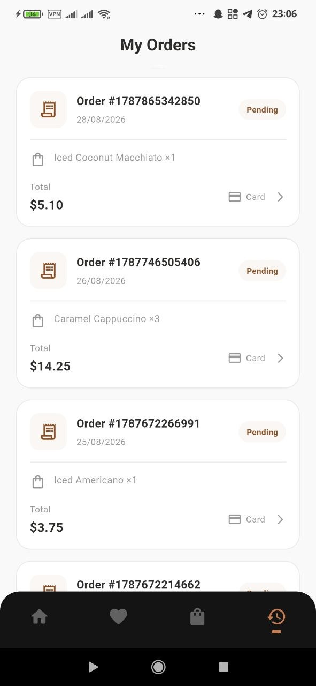  | 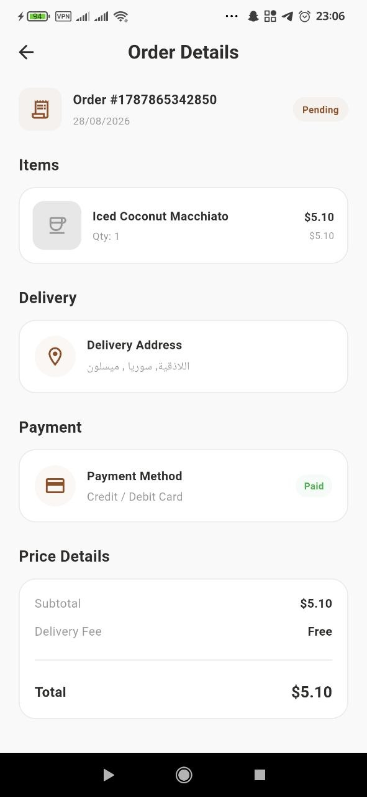     |
| ---------- | ------------- |
| 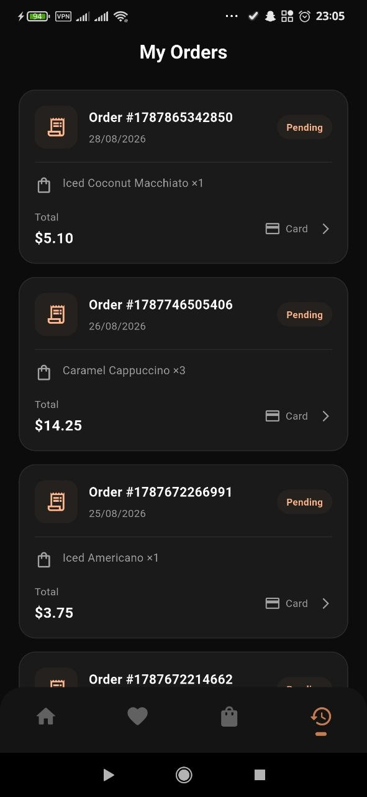  | 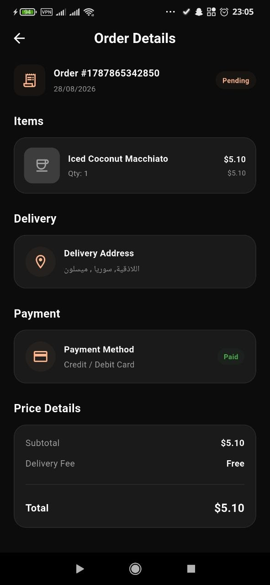    |

### ⚙️ Settings

| Settings    | About Us   |
| ---------- | ---------- |
| 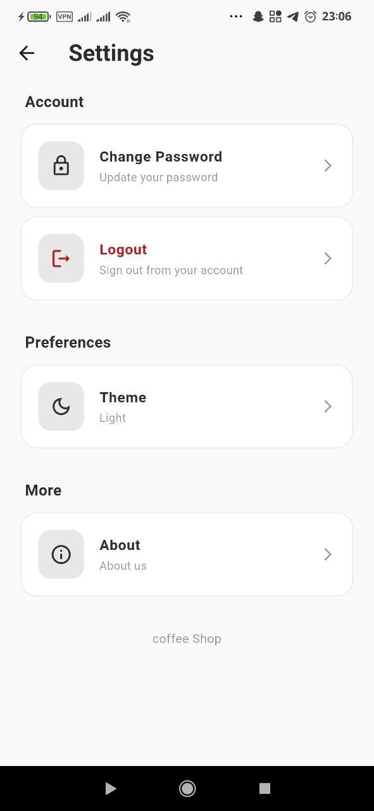   | 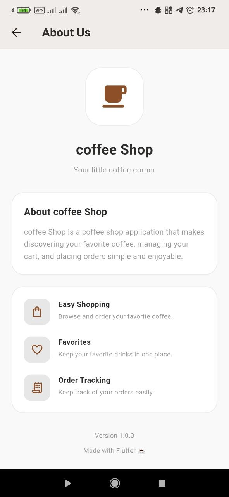  |
| ---------- |---------- |
|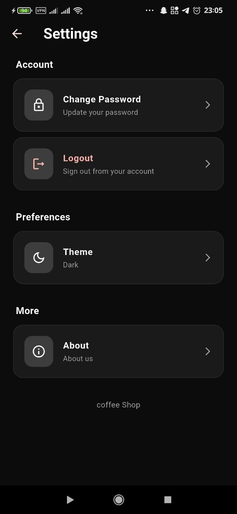  | 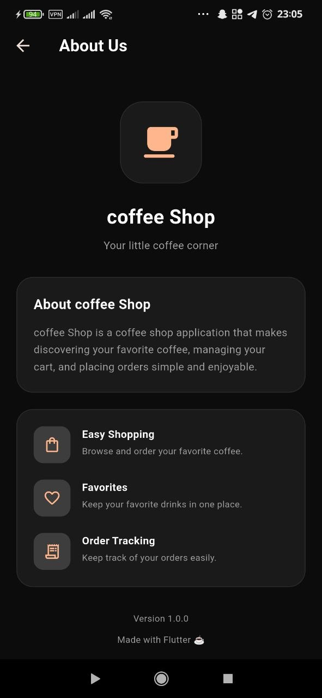  |


---

## 🛠️ Tech Stack

### Frontend

* **Flutter**
* **Dart**
* **Flutter Bloc / Cubit**
* **GoRouter**
* **Flutter ScreenUtil**

### Backend

* **Firebase Authentication**
* **Cloud Firestore**

### Local Storage

* **Sqflite**
* **SharedPreferences**
* **Flutter Secure Storage**

### Maps & Location

* **Flutter Map**
* **Geolocator**
* **Geocoding**
* **LatLong2**

### Testing

* **Flutter Test**
* **Bloc Test**
* **Mocktail**

### Other

* **Dartz** for functional error handling
* **Equatable** for state equality
* **Cached Network Image**
* **Internet Connection Checker**

### CI/CD

* **GitHub Actions**

---

## 🏗️ Architecture

Mini Shop follows a **feature-based architecture** with separation of presentation, business logic, data access, and shared application concerns.

```text
lib/
│
├── core/
│   ├── database/
│   ├── di/
│   ├── error/
│   ├── theme/
│   └── ...
│
├── feature/
│   ├── auth/
│   ├── home/
│   ├── favorites/
│   ├── cart/
│   ├── checkout/
│   ├── orders/
│   ├── settings/
│   └── ...
│
└── main.dart
```

Each feature is organized into layers:

```text
feature/
│
├── logic/
│   ├── cubit/
│   └── state/
│
├── ui/
│   ├── page
│   └── widget/
│
└── data/
    ├── model/
    ├── remote/
    ├── local/
    └── repository/
```

### Data Flow

```text
UI
 ↓
Cubit / Bloc
 ↓
Repository
 ↓
Remote / Local Service
 ↓
Firebase / Local Database
```

This structure keeps UI, business logic, and data access separated and makes individual features easier to maintain and test.

---

## 🔥 Firebase Backend

Firebase is used as the main backend infrastructure for the application.

### Firebase Authentication

The application supports:

* Email & Password Authentication
* Phone Authentication

### Cloud Firestore

Firestore is used to manage application data including:

* Users
* Products
* Categories
* Favorites
* Cart
* Orders

The repository and service layers are responsible for communicating with Firebase instead of accessing Firestore directly from the UI.

---

## 💾 Local Storage

Local storage is used where appropriate for application data and local persistence.

The project uses:

* **Sqflite**
* **SharedPreferences**
* **Flutter Secure Storage**

This allows the application to separate local data handling from remote Firebase operations.

---

## 🧪 Testing

The project includes automated tests for different application layers.

### Covered areas

* Cubit / Bloc business logic
* Repositories
* Widgets

Tests use:

* `flutter_test`
* `bloc_test`
* `mocktail`

Run all tests with:

```bash
flutter test
```

---

## 🔄 CI/CD

Mini Shop uses **GitHub Actions** to automate quality checks and Android builds.

The CI/CD workflow runs on pushes to the `main` and `ci-cd` branches and on pull requests targeting `main`.

### Pipeline

```text
Push / Pull Request
        ↓
Checkout Repository
        ↓
Setup Flutter
        ↓
Install Dependencies
        ↓
Flutter Analyze
        ↓
Flutter Test
        ↓
Build Release APK
        ↓
Upload APK Artifact
```

The pipeline automatically:

1. Sets up Flutter 3.38.1
2. Installs project dependencies
3. Runs `flutter analyze`
4. Runs the automated test suite
5. Builds a release APK
6. Uploads the generated APK as a GitHub Actions artifact

---

## 🌙 Theme Support

Mini Shop supports both **Light Mode** and **Dark Mode**.

The theme can be changed from the Settings screen, with the application's UI adapting consistently to the selected theme.

---

## 💳 Payment

The application includes a complete **checkout and payment UI flow**.

The current payment screen is implemented as a placeholder and is **not connected to a live payment gateway**.

A production payment provider can be integrated depending on the payment gateway supported by the target market.

---


## 📌 Future Improvements

Possible future improvements include:

* Integration with a production payment gateway
* Push notifications for order updates
* Real-time order status updates
* Admin dashboard for managing products and orders
* Additional shopping and personalization features

---

## 👩‍💻 Author

**Doaa Khadejeh**

Flutter Developer
